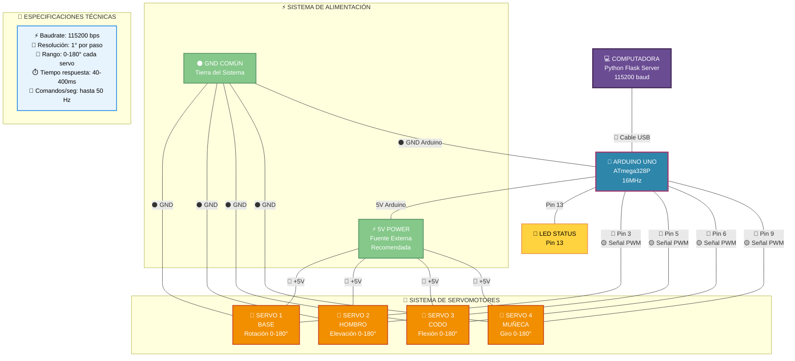

# 🤖 Control de Brazo Robótico - Sistema Completo

Sistema avanzado de control para brazo robótico con 4 servomotores, interfaz web personalizable y comunicación de alta velocidad.

   

## ✨ Características Principales

### 🚀 **Velocidad Extrema**
- **Comunicación a 115200 baudios** para máximo rendimiento
- **Movimientos ultra rápidos**: desde 40ms para micromovimientos
- **Control simultáneo** de 4 servomotores sin interferencia
- **Respuesta casi instantánea** a comandos web

### 🎨 **Interfaz Web Personalizable**
- **6 temas predefinidos**: Neon, Sunset, Ocean, Space, Forest, Cyber
- **Selector de colores en tiempo real**
- **Subida de imágenes de fondo personalizadas**
- **Efectos visuales avanzados** (blur, glow, partículas)
- **Modo claro/oscuro**
- **Guardado y carga de temas personalizados**

### ⚡ **Sistema de Control Avanzado**
- **4 servomotores independientes** (Base, Hombro, Codo, Muñeca)
- **Movimiento suave adaptativo** con curvas de aceleración
- **Control en tiempo real** vía WebSocket
- **Sistema de logs completo**
- **Estadísticas de rendimiento**
- **Presets de posiciones**

## 🔧 Instalación y Configuración

### Requisitos

#### Hardware
- **Arduino Uno/Nano/ESP32**
- **4 Servomotores SG90 o similares**
- **Fuente de alimentación 5V** (recomendada para servos)
- **Cables jumper**
- **Protoboard** (opcional)

#### Software
- **Python 3.7+**
- **Arduino IDE**
- **Navegador web moderno**

### 📦 Dependencias Python

```bash
pip install flask flask-socketio pyserial werkzeug
```

### 🔌 Conexiones Físicas

| Servo | Pin Arduino | Descripción |
|-------|-------------|-------------|
| Servo 1 | 3 | Base (rotación) |
| Servo 2 | 5 | Hombro |
| Servo 3 | 6 | Codo |
| Servo 4 | 9 | Muñeca/Garra |

**Conexiones de cada servo:**
- 🔴 **Cable Rojo** → 5V Arduino
- ⚫ **Cable Negro** → GND Arduino  
- 🟡 **Cable Amarillo** → Pin de señal correspondiente

**LED de estado:**
- 📍 **Pin 13** → LED indicador (integrado en Arduino)

### 📋 Diagrama de Conexiones

#### 🎯 **Esquema Completo del Sistema**



#### 🔌 **Tabla de Conexiones Detallada**

| 🎯 **Componente** | 📍 **Pin Arduino** | 🎨 **Color Cable** | ⚡ **Función** | 📝 **Descripción** |
|-------------------|--------------------|--------------------|-----------------|-------------------|
| **🔄 Servo Base** | Pin 3 (PWM) | 🟡 Amarillo | Señal Control | Rotación base 0-180° |
| **🦾 Servo Hombro** | Pin 5 (PWM) | 🟡 Amarillo | Señal Control | Elevación brazo 0-180° |
| **🔩 Servo Codo** | Pin 6 (PWM) | 🟡 Amarillo | Señal Control | Flexión articulación 0-180° |
| **✋ Servo Muñeca** | Pin 9 (PWM) | 🟡 Amarillo | Señal Control | Giro final 0-180° |
| **🔴 LED Estado** | Pin 13 | 🔴 Rojo | Indicador Visual | Estado de conexión |
| **⚡ Alimentación** | 5V | 🔴 Rojo | Poder (+) | Todos los servos |
| **⚫ Tierra** | GND | ⚫ Negro | Poder (-) | Referencia común |

#### 🔧 **Configuración de Pines Arduino**

```
      ARDUINO UNO - PINOUT ESPECÍFICO
  ┌─────────────────────────────────────┐
  │               [USB]                 │
  │   ┌─────────────────────────────┐   │
  │   │  🔴 Pin 13 → LED STATUS    │   │
  │   │  ⚪ Pin 12 → (Libre)       │   │
  │   │  ⚪ Pin 11 → (Libre)       │   │
  │   │  ⚪ Pin 10 → (Libre)       │   │
  │   │  🟡 Pin 9  → SERVO 4       │   │
  │   │  ⚪ Pin 8  → (Libre)       │   │
  │   │  ⚪ Pin 7  → (Libre)       │   │
  │   │  🟡 Pin 6  → SERVO 3       │   │
  │   │  🟡 Pin 5  → SERVO 2       │   │
  │   │  ⚪ Pin 4  → (Libre)       │   │
  │   │  🟡 Pin 3  → SERVO 1       │   │
  │   │  ⚪ Pin 2  → (Libre)       │   │
  │   │  📡 Pin 1  → TX (USB)      │   │
  │   │  📡 Pin 0  → RX (USB)      │   │
  │   └─────────────────────────────────┘   │
  │                                         │
  │  🔴 5V  ──────── Servos (+)            │
  │  ⚫ GND ──────── Servos (-)            │
  │  ⚪ 3.3V (No usar)                     │
  │  ⚪ VIN  (No usar)                     │
  └─────────────────────────────────────────┘
```

#### ⚡ **Especificaciones de Alimentación**

> **🚨 IMPORTANTE:** Para un funcionamiento óptimo, utiliza una **fuente externa de 5V** con capacidad suficiente para 4 servomotores.

| 📊 **Parámetro** | 🔢 **Valor** | 📝 **Observaciones** |
|-------------------|--------------|---------------------|
| **Voltaje Servos** | 5V DC | Requerido para SG90/MG90S |
| **Corriente por Servo** | 100-500mA | Según carga mecánica |
| **Corriente Total** | 2A máximo | Para 4 servos + Arduino |
| **Voltaje Arduino** | 5V (USB) | Alimentado por computadora |
| **Comunicación** | 115200 baud | Alta velocidad garantizada |

#### 🎯 **Guía de Ensamblaje Paso a Paso**

1. **🔌 Conexión de Señales**
   ```
   Arduino Pin 3  →  Servo 1 (Cable Amarillo)
   Arduino Pin 5  →  Servo 2 (Cable Amarillo)  
   Arduino Pin 6  →  Servo 3 (Cable Amarillo)
   Arduino Pin 9  →  Servo 4 (Cable Amarillo)
   ```

2. **⚡ Conexión de Alimentación**
   ```
   Arduino 5V     →  Todos los Servos (Cable Rojo)
   Arduino GND    →  Todos los Servos (Cable Negro)
   ```

3. **🔴 LED de Estado**
   ```
   Arduino Pin 13 →  LED (Integrado en placa)
   ```

4. **📡 Comunicación**
   ```
   Arduino USB    →  Computadora (115200 baud)
   ```

#### 🛡️ **Consejos de Seguridad**

- ✅ **Verifica polaridad** antes de conectar alimentación
- ✅ **Usa fuente externa** para evitar sobrecarga del Arduino
- ✅ **Conecta GND primero** antes que VCC
- ✅ **Revisa continuidad** de todas las conexiones
- ✅ **Evita cortocircuitos** con cables sueltos
- ✅ **Prueba un servo a la vez** inicialmente

#### 🔧 **Herramientas Necesarias**

| 🛠️ **Herramienta** | 📝 **Uso** |
|-------------------|------------|
| **Multímetro** | Verificar continuidad y voltajes |
| **Destornilladores** | Ajustar terminales |
| **Alicates** | Pelar y doblar cables |
| **Protoboard** | Conexiones temporales |
| **Cables Jumper** | Interconexiones flexibles |
| **Fuente 5V** | Alimentación externa |

## 🚀 Instalación Paso a Paso

### 1. 📤 Cargar Código Arduino

1. Abre **Arduino IDE**
2. Copia el código Arduino del archivo `arduino_4_servos_ultra_fast.ino`
3. Selecciona tu placa y puerto
4. **Configura el monitor serial a 115200 baudios**
5. Sube el código

### 2. 🔧 Configurar Python

1. Clona o descarga el proyecto:
```bash
git clone https://github.com/tu-usuario/robotic-arm-control.git
cd robotic-arm-control
```

2. Instala dependencias:
```bash
pip install -r requirements.txt
```

3. Ejecuta el servidor:
```bash
python app.py
```

### 3. 🌐 Abrir Interfaz Web

1. Abre tu navegador
2. Ve a: `http://localhost:5000`
3. Conecta al puerto serial correspondiente
4. ¡Disfruta del control de velocidad extrema!

## 🎮 Uso del Sistema

### Conexión

1. **Conecta el Arduino** vía USB
2. **Identifica el puerto** (ej: `COM3` en Windows, `/dev/ttyUSB0` en Linux)
3. **Ingresa el puerto** en la interfaz web
4. **Haz clic en "Conectar 115200"**
5. **Verifica el LED verde** de estado

### Control de Servos

#### 🎛️ **Sliders Interactivos**
- Mueve los sliders para control en tiempo real
- **Respuesta instantánea** con movimiento suave
- **Control simultáneo** de múltiples servos

#### ⌨️ **Comandos de Prueba**

En el monitor serial de Arduino (115200 baudios):

```
servo1:45        # Mover servo 1 a 45°
servo2:90        # Mover servo 2 a 90°
servo3:135       # Mover servo 3 a 135°
servo4:60        # Mover servo 4 a 60°
```

**JSON completo:**
```json
{"servo1":90,"servo2":45,"servo3":135,"servo4":60}
```

#### 🚀 **Pruebas de Velocidad**

| Movimiento | Ángulos | Tiempo | Velocidad |
|------------|---------|--------|-----------|
| Micro | 3° | 40ms | ⚡ INSTANTÁNEO |
| Pequeño | 8° | 60ms | ⚡ SÚPER RÁPIDO |
| Mediano | 20° | 120ms | 🔥 RÁPIDO |
| Grande | 40° | 200ms | ⚙️ NORMAL |
| Extremo | 180° | 400ms | 🎯 CONTROLADO |

### 🎨 Personalización

#### **Temas Predefinidos**
- 🌈 **Neon**: Colores vibrantes y brillantes
- 🌅 **Sunset**: Tonos cálidos de atardecer
- 🌊 **Ocean**: Azules profundos del océano
- 🚀 **Space**: Colores oscuros espaciales
- 🌲 **Forest**: Verdes naturales del bosque
- 🤖 **Cyber**: Estilo futurista tecnológico

#### **Controles Avanzados**
- **Selector de colores** para cada elemento
- **Transparencia de tarjetas** ajustable
- **Intensidad de efectos blur**
- **Partículas animadas** configurables
- **Efectos glow** activables/desactivables

## 📊 Especificaciones Técnicas

### Rendimiento
- **Baudrate**: 115200 bps
- **Tiempo de respuesta**: 40-400ms según distancia
- **Comandos por segundo**: Hasta 50 Hz
- **Precisión**: 1° por paso
- **Rango de movimiento**: 0-180° por servo

### Compatibilidad
- **Arduino**: Uno, Nano, Pro Mini, ESP32
- **Servos**: SG90, MG90S, MG996R, y compatibles
- **Navegadores**: Chrome, Firefox, Safari, Edge
- **Sistemas**: Windows, macOS, Linux, Raspberry Pi

### Comunicación
- **Protocolo**: JSON sobre Serial
- **WebSocket**: Tiempo real bidireccional
- **API REST**: Control programático
- **Heartbeat**: Monitoreo de conexión

## 🛠️ Comandos Especiales

### Comandos del Sistema

```
CMD:RESET      # Resetear todos los servos a 90°
CMD:STATUS     # Mostrar estado completo del sistema
CMD:SMOOTH     # Activar modo movimiento suave
CMD:DIRECT     # Activar modo movimiento directo
CMD:SAFE       # Mover a posición segura
CMD:VERBOSE_ON # Activar logs detallados
CMD:VERBOSE_OFF# Desactivar logs detallados
```

### API REST Endpoints

| Endpoint | Método | Descripción |
|----------|--------|-------------|
| `/api/connect` | POST | Conectar al puerto serial |
| `/api/disconnect` | POST | Desconectar |
| `/api/servo` | POST | Controlar servomotores |
| `/api/reset` | GET | Resetear posiciones |
| `/api/status` | GET | Estado del sistema |
| `/api/upload_background` | POST | Subir imagen de fondo |
| `/api/update_theme` | POST | Actualizar tema |

## 🔍 Troubleshooting

### Problemas Comunes

#### ❌ **No se conecta**
- ✅ Verifica el puerto serial correcto
- ✅ Confirma que Arduino esté conectado
- ✅ Revisa que no esté abierto en otro programa
- ✅ Comprueba los 115200 baudios

#### ❌ **Servos no se mueven**
- ✅ Revisa conexiones de alimentación (5V, GND)
- ✅ Verifica cables de señal en pines correctos
- ✅ Comprueba que los servos estén funcionando
- ✅ Confirma suficiente corriente (fuente externa)

#### ❌ **Movimiento lento o errático**
- ✅ Confirma 115200 baudios en ambos lados
- ✅ Reduce carga mecánica en los servos
- ✅ Verifica alimentación estable
- ✅ Revisa interferencias electromagnéticas

#### ❌ **Interfaz web no carga**
- ✅ Confirma que Python está ejecutándose
- ✅ Verifica puerto 5000 disponible
- ✅ Comprueba firewall/antivirus
- ✅ Intenta con otro navegador

### 📞 **Obtener Ayuda**

Si tienes problemas:

1. **Revisa los logs** en la interfaz web
2. **Verifica el monitor serial** de Arduino
3. **Comprueba las conexiones** físicas
4. **Consulta la documentación** completa
5. **Reporta bugs** con detalles específicos

## 🎯 Proyectos de Ejemplo

### Básico: Control Manual
```python
import requests

# Mover servo 1 a 45°
response = requests.post('http://localhost:5000/api/servo', 
                        json={'servo1': 45})
```

### Intermedio: Secuencia Automatizada
```python
import time
import requests

url = 'http://localhost:5000/api/servo'

# Secuencia de movimientos
movimientos = [
    {'servo1': 0, 'servo2': 0, 'servo3': 0, 'servo4': 0},
    {'servo1': 90, 'servo2': 45, 'servo3': 90, 'servo4': 45},
    {'servo1': 180, 'servo2': 90, 'servo3': 180, 'servo4': 90},
    {'servo1': 90, 'servo2': 90, 'servo3': 90, 'servo4': 90}
]

for movimiento in movimientos:
    requests.post(url, json=movimiento)
    time.sleep(1)
```

### Avanzado: Control por Joystick
```python
import pygame
import requests

pygame.init()
joystick = pygame.joystick.Joystick(0)
joystick.init()

url = 'http://localhost:5000/api/servo'

while True:
    pygame.event.pump()
    
    # Mapear ejes del joystick a servos
    servo1 = int((joystick.get_axis(0) + 1) * 90)
    servo2 = int((joystick.get_axis(1) + 1) * 90)
    servo3 = int((joystick.get_axis(2) + 1) * 90)
    servo4 = int((joystick.get_axis(3) + 1) * 90)
    
    requests.post(url, json={
        'servo1': servo1,
        'servo2': servo2,
        'servo3': servo3,
        'servo4': servo4
    })
    
    time.sleep(0.05)  # 20 Hz
```

## 📈 Futuras Mejoras

### En Desarrollo
- [ ] **Control por voz** con reconocimiento de comandos
- [ ] **Programación visual** tipo Scratch/Blockly
- [ ] **Grabación y reproducción** de secuencias
- [ ] **Control por gestos** con cámara web
- [ ] **Integración con ROS** (Robot Operating System)

### Próximas Versiones
- [ ] **Soporte para más servos** (hasta 16)
- [ ] **Control PID avanzado** para precisión máxima
- [ ] **Simulador 3D** del brazo robótico
- [ ] **App móvil** para Android/iOS
- [ ] **Modo autónomo** con IA

## 📄 Licencia

Este proyecto está bajo la **Licencia MIT** - ve el archivo [LICENSE](LICENSE) para detalles.

## 🤝 Contribuciones

¡Las contribuciones son bienvenidas!

1. **Fork** el proyecto
2. **Crea** tu rama de feature (`git checkout -b feature/AmazingFeature`)
3. **Commit** tus cambios (`git commit -m 'Add some AmazingFeature'`)
4. **Push** a la rama (`git push origin feature/AmazingFeature`)
5. **Abre** un Pull Request

## 👨‍💻 Autor

[Tu nombre aquí]

## 🙏 Agradecimientos

- **Arduino Community** por el soporte de hardware
- **Flask Team** por el framework web
- **Socket.IO** por la comunicación en tiempo real
- **Font Awesome** por los iconos
- **La comunidad de robótica** por la inspiración

---

## 🚀 ¡Construye tu Brazo Robótico Hoy!

Con este sistema tendrás:
- ⚡ **Velocidad extrema** de control
- 🎨 **Interfaz hermosa y personalizable**
- 🔧 **Facilidad de uso** para todos los niveles
- 🚀 **Expansibilidad** para proyectos futuros

**¡Dale estrella ⭐ al proyecto si te fue útil!**
